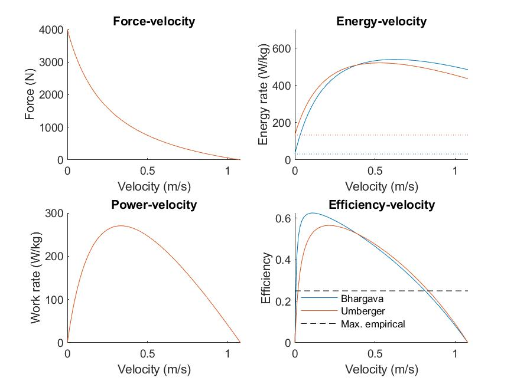

# metabolic_model_testing

Here, I aim to test models that are popular in whole-body movement simulation for predictions of energetic cost in controlled experimental conditions. Currently, I considered the energetic aspect of the force-velocity relation, described by efficiency-velocity.

### Empirical data
The efficiency-velocity relation has been found to have a hyperbolic shape. Efficiency is equal to zero at both zero velocity and maximal contraction velocity, because both are associated with zero mechanical work. Efficiency is maximal at intermediate contraction velocity of about 20% maximal shortening velocity (Barclay, 2015). Peak muscle efficiency is generaly thought to be about 20-30% (e.g., Margaria, 1968; Pugh, 1974). This efficiency can be understood from the product of two types of efficiencies. The first is cross-bridge efficiency, defined as the fraction of ATP consumed by myosin ATPase that is converted into work. Cross-bridge efficiency has been found to approach 50% during slow contraction (Barclay, 2015). The second efficiency term is the phosphorylation efficiency, defined as the fraction of chemical energy in food converted to chemical energy in ATP. Phosphorylation efficiency is thought to be about 60% for aerobic energy consumption (van Ingen Schenau et al., 1997). The product of the two efficiencies yields an overall maximal muscle efficiency of 30%. Measured efficiencies during movements such as uphill walking (Margaria, 1968) and cycling (Pugh, 1974) are generally a bit smaller, ranging from 20-25%. This somewhat smaller efficiency may in part be due to other energy consuming processess besides cross-bridge cycling (and ATP synthesis), such as active ion transport (Na+, K+, Ca2+). 

### Metabolic models
Metabolic cost predictions of two popular metabolic models are considered here, one proposed by Umberger et al. (2003), the other by Bhargava et al. (2004). These models predict overall energy consumption from heat terms and a mechanical work term. The coefficients are mostly based on animal experiments (e.g. frog, mouse, rat), and scaled to human geometry and/or temperature. The models are often used in whole-body simulation of human movements.

### Predicted cost of whole-body movements
Musculoskeletal models incoorporating muscle models have been found to reproduce measured energetic cost for nomimal walking (Umberger et al., 2003; Bhargava et al., 2004), but the effect of movement parameters on energetic cost is generally not well predicted. For example, Koelewijn et al. (2019) found that all tested metabolic models (incl. those considered here) greatly underestimated the increase in energetic cost with incline during uphill walking. Most models underestimated the cost by about a factor 2. This suggests that the metabolic muscle models are too efficient at performing mechanical work. This should imply that the efficiency-velocity relation of these models has a peak value that is too high compared to empirical estimates and considerations of underlying cross-bridge and phophorylation efficiencies. 

### main.m
The main.m script evaluated predictions of tow metabolic models for typical force-velocity experiments. Note:
- Muscle length is assumed to be optimal
- Activation heat is neglected, considering that muscle has been turned on and it has decayed
- Default parameter values roughly resemble human quadriceps, they may be changed

### Figure 1: Cost predictions of metabolic models for constant velocity experiment

Note: in top-right panel, the dotted lines indicate the maintenance heat term, the solid lines indicate maintenance + shortening heat + work. In bottom-right panel, the dashed black line indicated the maximal empirical efficiency. 

### Conclusion
It seems that current metabolic muscle models are too efficient at performing mechanical work. This may explain why movement simulations that incoorporate these models generally underpredict the increase in energetic cost with incline during uphill walking. Similarly, models may be expected to underestimate the increase in energetic cost with work-rate in cycling. 

### References
Barclay, C. J. (2015). Energetics of contraction. Comprehensive Physiology, 5(2), 961–995. https://doi.org/10.1002/cphy.c140038

Bhargava, L. J., Pandy, M. G., & Anderson, F. C. (2004). A phenomenological model for estimating metabolic energy consumption in muscle contraction. Journal of Biomechanics, 37(1), 81–88. https://doi.org/10.1016/s0021-9290(03)00239-2

Koelewijn, A. D., Heinrich, D., & van den Bogert, A. J. (2019). Metabolic cost calculations of gait using musculoskeletal energy models, a comparison study. PLoS ONE, 14(9). https://doi.org/10.1371/journal.pone.0222037

Margaria, R. (1968). Positive and negative work performances and their efficiencies in human locomotion. Internationale Zeitschrift Für Angewandte Physiologie Einschließlich Arbeitsphysiologie, 25(4), 339–351. https://doi.org/10.1007/BF00699624

Pugh, L. G. (1974). The relation of oxygen intake and speed in competition cycling and comparative observations on the bicycle ergometer. The Journal of Physiology, 241(3), 795–808. https://doi.org/10.1113/jphysiol.1974.sp010685

Umberger, B. R., Gerritsen, K. G. M., & Martin, P. E. (2003). A model of human muscle energy expenditure. Computer Methods in Biomechanics and Biomedical Engineering, 6(2), 99–111. https://doi.org/10.1080/1025584031000091678

